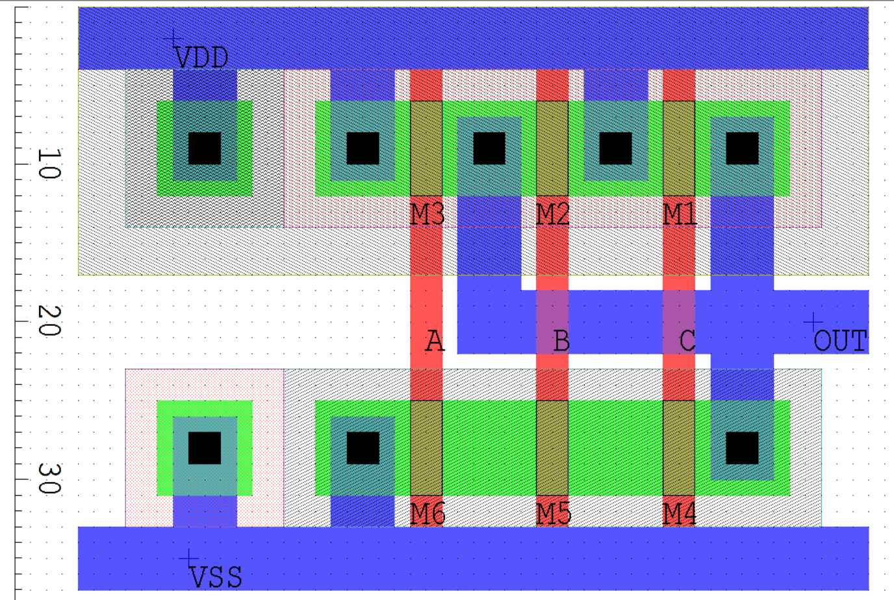
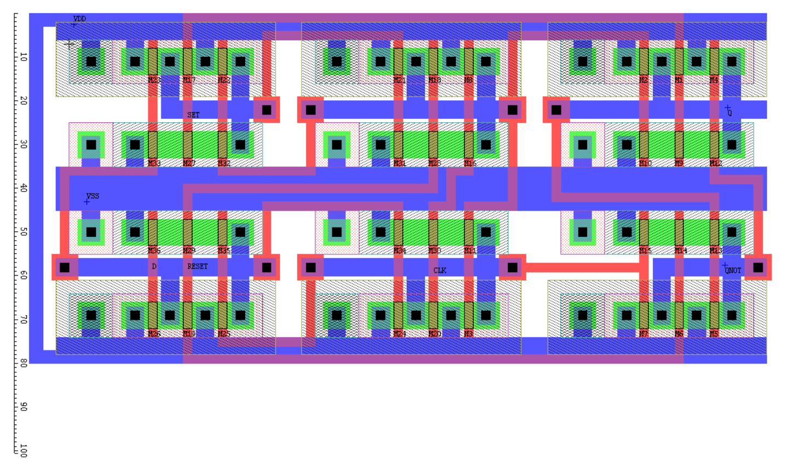
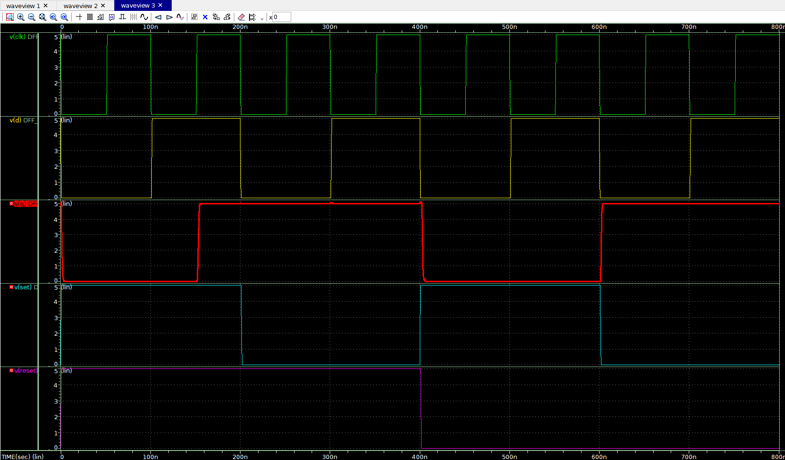

<!-- About the Project -->
## About

Implemented a D flipflop  
- with asynch `reset` and `enable`
- using 3 input `NAND`s

### NAND Logic Circuit

## Layouts

Open `LEDIT_MOSIS/MORBN20.TDB` using `L-EDIT` to view the layouts.  

### 3 input NAND

### D Flipflop

## Test

Open `Spice outputs/DFF_wdf.tr0` using `Custom WaveView` to view the test results.  

